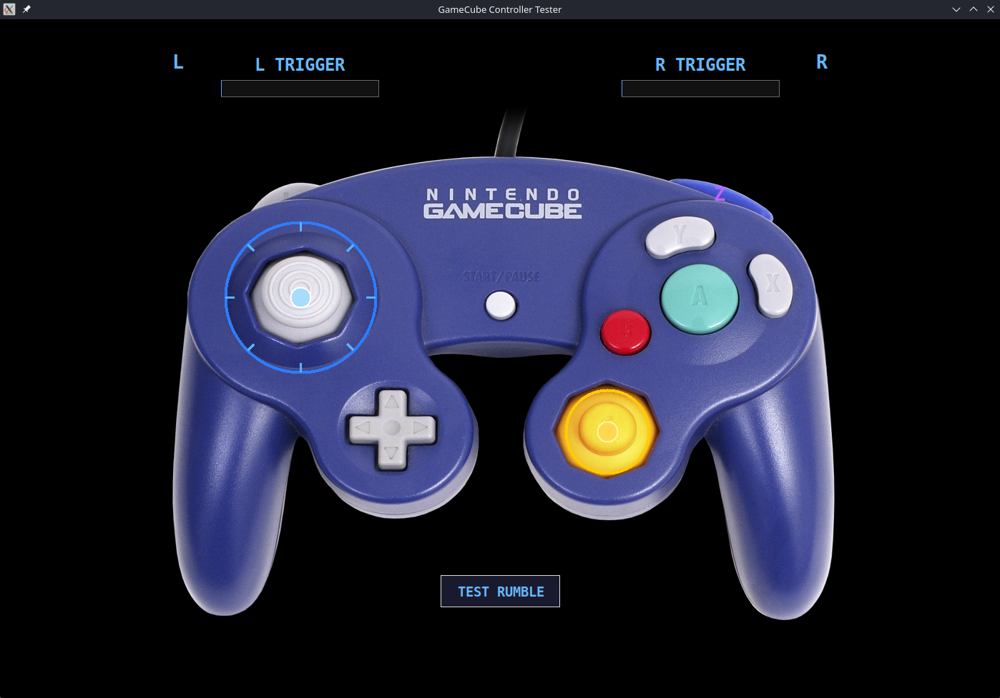

# GameCube Controller Tester

A controller tester for the Mayflash GameCube adapter on Linux, available as both a graphical and command line application.



## Download

Pre-compiled binaries for Linux are available on the [Releases](https://github.com/alex-engelmann/gc_controller_tester/releases) page.

Download the latest `gc-controller-tester-v*.zip`, extract it, and follow the First Time Setup instructions below.

## Programs

### gc_gui_controller_tester — graphical tester
Displays a real-time overlay on a GameCube controller image showing button presses, analog stick positions, and trigger values. Built with Python and Tkinter.

**Binary:**
```bash
./gc_gui_controller_tester
```

**Python:**
```bash
python3 gc_gui_controller_tester.py
```

### gc_cli_controller_tester — command line tester
Prints button and axis events to the terminal as they occur. Useful for scripting, debugging, or headless systems.

**Binary:**
```bash
./gc_cli_controller_tester
```

**Python:**
```bash
python3 gc_cli_controller_tester.py
```

## Requirements

### Using the binaries
- `libusb` (usually pre-installed on Bazzite/Fedora/Ubuntu)

### Using the Python scripts
- Python 3
- `pyusb` and `Pillow` Python packages
- `libusb` (usually pre-installed on Bazzite/Fedora/Ubuntu)

## First Time Setup

Run the udev setup script once:

```bash
./install-udev-rules.sh
```

This creates `/etc/udev/rules.d/51-gcadapter.rules`, which gives the application permission to access the adapter and unbinds the default kernel HID driver so the app can communicate with it directly via libusb.

After running the script, unplug and replug your adapter.

## Why Wii U mode?

In PC mode the Mayflash adapter identifies itself as a Pokken Tournament controller with an incomplete HID descriptor — the C-stick Y axis is missing entirely. In Wii U mode it presents as a Nintendo Wii U GameCube Adapter (`057e:0337`), which allows direct libusb access and full input fidelity across all axes and buttons.

## Troubleshooting

**`libusb` not found:**
```bash
# Fedora
sudo dnf install libusb

# Ubuntu/Debian
sudo apt install libusb-1.0-0
```

**`pyusb` or `Pillow` not found (Python only):**
```bash
pip install pyusb pillow
```

**Device not found / permission error:**
- Make sure the adapter is in Wii U mode
- Re-run `./install-udev-rules.sh`
- Unplug and replug the adapter

**Controller not responding:**
- Check the controller is plugged into port 1 of the adapter

**Only one program can use the adapter at a time:**
- Close any other instance of the tester before launching a second one

## How it works

Both programs communicate directly with the adapter via libusb, bypassing the Linux kernel's HID input layer entirely. They read raw 37-byte USB packets from the adapter at endpoint `0x81`, decoding button states and axis values according to the Wii U GameCube adapter protocol.

## Building from source

PyInstaller is required to compile the binaries:

```bash
pip install pyinstaller
```

**GUI:**
```bash
pyinstaller --onefile --windowed \
  --add-data "controller.png:." \
  --hidden-import "PIL._tkinter_finder" \
  --name "gc_gui_controller_tester" \
  gc_gui_controller_tester.py
```

**CLI:**
```bash
pyinstaller --onefile \
  --name "gc_cli_controller_tester" \
  gc_cli_controller_tester.py
```

Compiled binaries will appear in the `dist/` folder.

## Image credit

Controller image: [Evan-Amos](https://commons.wikimedia.org/w/index.php?curid=11422462), derivative work by Alphathon, CC BY-SA 3.0

## License

GPL
